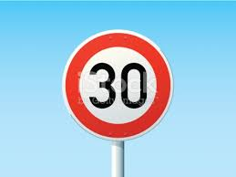
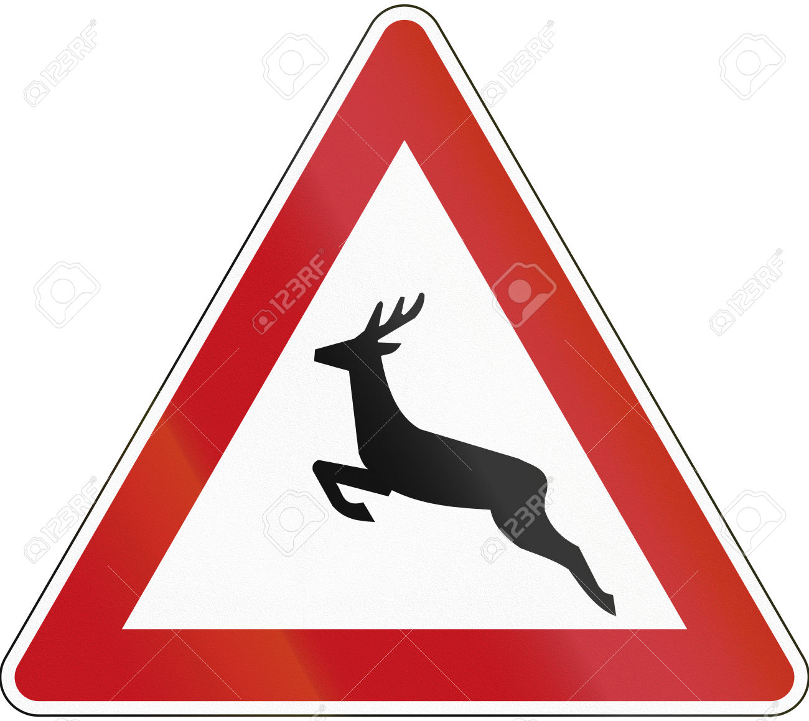
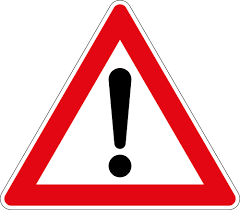
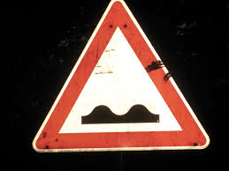
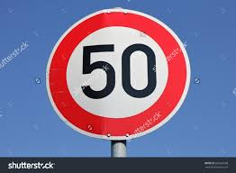

#**Traffic Sign Recognition** 

##Writeup Template

###You can use this file as a template for your writeup if you want to submit it as a markdown file, but feel free to use some other method and submit a pdf if you prefer.

---

**Build a Traffic Sign Recognition Project**

The goals / steps of this project are the following:
* Load the data set (see below for links to the project data set)
* Explore, summarize and visualize the data set
* Design, train and test a model architecture
* Use the model to make predictions on new images
* Analyze the softmax probabilities of the new images
* Summarize the results with a written report

[//]: # (Image References)

[image0]: ./traffic_sign/data_visual.PNG "Visual"
[image1]: ./traffic_sign/data_distrib.PNG "Dist"
[image2]: ./traffic_sign/x_train_norm.PNG "Grayscaling"
[image3]: ./traffic_sign/x_train.PNG "Random Noise"
[image4]: ./traffic_sign/traffic_sign_01.jpg "Traffic Sign 1"
[image5]: ./traffic_sign/traffic_sign_02.jpg "Traffic Sign 2"
[image6]: ./traffic_sign/traffic_sign_03.jpg "Traffic Sign 3"
[image7]: ./traffic_sign/traffic_sign_04.jpg "Traffic Sign 4"
[image8]: ./traffic_sign/traffic_sign_05.jpg "Traffic Sign 5"

## Rubric Points
###Here I will consider the [rubric points](https://review.udacity.com/#!/rubrics/481/view) individually and describe how I addressed each point in my implementation.  

---
###Writeup / README

####1. Provide a Writeup / README that includes all the rubric points and how you addressed each one. You can submit your writeup as markdown or pdf. You can use this template as a guide for writing the report. The submission includes the project code.

You're reading it! and here is a link to my [project code](https://github.com/udacity/CarND-Traffic-Sign-Classifier-Project/blob/master/Traffic_Sign_Classifier.ipynb)

###Data Set Summary & Exploration

####1. Provide a basic summary of the data set. In the code, the analysis should be done using python, numpy and/or pandas methods rather than hardcoding results manually.

I used the pandas library to calculate summary statistics of the traffic
signs data set:

* The size of training set is ? 34799 but I added more duplicated data set for the labels having fewer samples
* The size of the validation set is ? 4410
* The size of test set is ? 12630
* The shape of a traffic sign image is ? 32, 32, 3
* The number of unique classes/labels in the data set is ? 43

####2. Include an exploratory visualization of the dataset.

Here is an exploratory visualization of the data set. It is a bar chart showing how the train data histogram, I noticed that the bins or the number of data for each label is not well distributed, so I generate more data samples by duplicating them for the labels having fewer samples than other.

Data visualizaiton

![image0]

Train data before and after the preprocess

![image1]

###Design and Test a Model Architecture

####1. Describe how you preprocessed the image data. What techniques were chosen and why did you choose these techniques? Consider including images showing the output of each preprocessing technique. Pre-processing refers to techniques such as converting to grayscale, normalization, etc. (OPTIONAL: As described in the "Stand Out Suggestions" part of the rubric, if you generated additional data for training, describe why you decided to generate additional data, how you generated the data, and provide example images of the additional data. Then describe the characteristics of the augmented training set like number of images in the set, number of images for each class, etc.)

As a first step, I decided to resize the images to 32x32x1 from 32x32x3 to convert it to gray scale and then normalize the image.
Here is an example of a traffic sign image before and after grayscaling and normalization.

![gray and nrom][image2]

As a last step, I normalized the image data because the zero mean data is required for the input of the model.
I decided to generate additional train data since I noticed that the bins or the number of data for each label is not well distributed, so I generate more data samples by duplicating them for the labels having fewer samples than other, in that way the model will be well trained for all labels or avoid to be overfitting for some specific labels only.

To add more data to the the data set, I look at the number of sample per label coming out of the histogram plot output and applied a threshold to the normalized number of samples to generate by duplicating existing data.

Here is an example of an original image and an augmented image:

![Original image][image3]

The difference between the original data set and the augmented data set is the following
Original train data size is 34799
Updated train data size is 61526

####2. Describe what your final model architecture looks like including model type, layers, layer sizes, connectivity, etc.) Consider including a diagram and/or table describing the final model.

My final model consisted of the following layers:

| Layer         		|     Description	        					| 
|:---------------------:|:---------------------------------------------:| 
| Input         		| 32x32x1 gray image   							| 
| Convolution 3x3     	| 1x1 stride, same padding, outputs 28x28x6 	|
| RELU					|	Acticvation		|
| Max pooling	      	| 2x2 stride,  outputs 14x14x6 				|
| Convolution 3x3	    | 1x1 stride, same padding, outputs 10x10x16	|
| RELU					|	Acticvation		|
| Max pooling	      	| 2x2 stride,  outputs 10x10x16 				|
| Flatten    	| output 400 				|
| Fully connected		| output 120   		|
| RELU					|	Acticvation		|
| Dropout					|	Dropout		|
| Fully connected		| output 84   		|
| RELU					|	Acticvation		|
| Fully connected		| output 43   		|
| Softmax			|         									|
| Cross entropy		|             	 |
 

####3. Describe how you trained your model. The discussion can include the type of optimizer, the batch size, number of epochs and any hyperparameters such as learning rate.

To train the model, I used those parameters below
* EPOCHS = 10
* BATCH_SIZE = 128
* LEARN_RATE = 0.001
* KEEP_PROB = 0.5

####4. Describe the approach taken for finding a solution and getting the validation set accuracy to be at least 0.93. Include in the discussion the results on the training, validation and test sets and where in the code these were calculated. Your approach may have been an iterative process, in which case, outline the steps you took to get to the final solution and why you chose those steps. Perhaps your solution involved an already well known implementation or architecture. In this case, discuss why you think the architecture is suitable for the current problem.
The importanct thing which took me long time to figure out is that the KEEP_PROB for the dropout should be applied only for the training not for the validation otherwise I'd get lower validation accuracy from the trained model.
Another thing which also helps to get better validation accuracy is to generate more test data by looking at the histogram plot.
The small learning rate is also a key point to get converge into the right place for the network model.

My final model results were:
* training set accuracy of, I didn' run the training set since it was not recommened in the class
* validation set accuracy of 0.944
* test set accuracy of ? 9.25

If an iterative approach was chosen:
* What was the first architecture that was tried and why was it chosen?
* What were some problems with the initial architecture?
* How was the architecture adjusted and why was it adjusted? Typical adjustments could include choosing a different model architecture, adding or taking away layers (pooling, dropout, convolution, etc), using an activation function or changing the activation function. One common justification for adjusting an architecture would be due to overfitting or underfitting. A high accuracy on the training set but low accuracy on the validation set indicates over fitting; a low accuracy on both sets indicates under fitting.
* Which parameters were tuned? How were they adjusted and why?
* What are some of the important design choices and why were they chosen? For example, why might a convolution layer work well with this problem? How might a dropout layer help with creating a successful model?

If a well known architecture was chosen:
* What architecture was chosen?
* Why did you believe it would be relevant to the traffic sign application?
* How does the final model's accuracy on the training, validation and test set provide evidence that the model is working well?
 
 My model is based on the LeNet acchitecture by adapting the number of classes of the traffic sign.
 I picked up the LeNet architecture since its input expects to be an image and it has all necessary code cells, convolution, activation, pooling ect, and it looks very suit for the traffic sign classifier. 

###Test a Model on New Images

####1. Choose five German traffic signs found on the web and provide them in the report. For each image, discuss what quality or qualities might be difficult to classify.

Here are five German traffic signs that I found on the web:
I tried to pick up vivid images in color to ease the classificatoin for the model, but the size is different so I had to resize them into 32x32x1 for the gray scale, I also noticed that the weakness in my model is to classify the numbers for the speed limit so I added some speed limit signs as well.

 
 
 
 
 
 

####2. Discuss the model's predictions on these new traffic signs and compare the results to predicting on the test set. At a minimum, discuss what the predictions were, the accuracy on these new predictions, and compare the accuracy to the accuracy on the test set (OPTIONAL: Discuss the results in more detail as described in the "Stand Out Suggestions" part of the rubric).

Here are the results of the prediction:

| Image			        |     Prediction	        					| 
|:---------------------:|:---------------------------------------------:| 
| Speed limit (30km/h)      		| Speed limit (30km/h)  									| 
| Wild animals crossing    			| Wild animals crossing										|
| General caution				| General caution											|
| Bumpy road      		| Bumpy Road					 				|
| Yield		| Yield     							|
| Speed limit (50km/h) | Dangerous curve to the right |

The model was able to correctly guess 5 of the 6 traffic signs, which gives an accuracy of 83.3%.
The accuracy with the additional traffic signs is lower than the test data accuracy which is 92.5% but the sample size of the new images is only 6, so If I test more samples, the accuracy would be getting closer, as expected my model failed one of the speed signs, the 50 km speed limit sign is detected as Dangerous curve to the right which is very irrelative, I guess the numbers or letters seem more challenge for the model for the traffic sign since the size of the letters become shrinked after resizing them, in overall my model did goog job on the new images.

####3. Describe how certain the model is when predicting on each of the five new images by looking at the softmax probabilities for each prediction. Provide the top 5 softmax probabilities for each image along with the sign type of each probability. (OPTIONAL: as described in the "Stand Out Suggestions" part of the rubric, visualizations can also be provided such as bar charts)

Top 5 softmax result, image:0 label:1.0
TopKV2(values=array([[ 0.98220634,  0.0096279 ,  0.00430604,  0.00142936,  0.00125175]], dtype=float32), indices=array([[ 1,  0, 13, 35,  4]]))

Top 5 softmax result, image:1 label:31.0
TopKV2(values=array([[  9.99999762e-01,   1.94290564e-07,   8.44103809e-09,
          5.60107472e-09,   3.11846082e-09]], dtype=float32), indices=array([[31, 27, 18, 24, 25]]))
          
Top 5 softmax result, image:2 label:18.0
TopKV2(values=array([[  1.00000000e+00,   1.52296003e-12,   4.00296929e-13,
          1.13471628e-19,   4.94858283e-24]], dtype=float32), indices=array([[18, 11, 27, 26, 24]]))
          
Top 5 softmax result, image:3 label:22.0
TopKV2(values=array([[  1.00000000e+00,   9.77921520e-13,   1.82035830e-15,
          4.58481530e-17,   7.03200797e-18]], dtype=float32), indices=array([[22, 17, 29, 31, 23]]))
          
Top 5 softmax result, image:4 label:13.0
TopKV2(values=array([[  1.00000000e+00,   7.61624236e-11,   1.08096197e-13,
          1.14891251e-17,   1.52724890e-18]], dtype=float32), indices=array([[13, 34, 35,  9, 40]]))
          
Top 5 softmax result, image:5 label:2.0
TopKV2(values=array([[ 0.7386049 ,  0.15407118,  0.09871594,  0.00172752,  0.00152657]], dtype=float32), indices=array([[20, 40, 10, 31, 18]]))

### (Optional) Visualizing the Neural Network (See Step 4 of the Ipython notebook for more details)
####1. Discuss the visual output of your trained network's feature maps. What characteristics did the neural network use to make classifications?

